
<h1 align="center">美食推荐系统</h1>

## 简介
美食推荐系统：角色分为管理员、用户；功能包括用户注册登录、美食店铺管理、热门美食推荐、美食教程与社区互动、个人资料管理、评论与反馈功能。设计简洁，提升用户体验。    --计算机毕业设计源码；毕设源码；java毕业设计源码

## 联系方式

<h3 align="center">获取完整代码与数据库文件 + 微信：deepguan QQ: 86050149 QQ群: 783742310</h3>

<h3 align="center">可帮忙远程部署 包运行成功！提供远程部署、修改代码、设计文档指导、代码讲解等服务！</h3>

## 功能介绍（完整见运行截图）
管理员：基本功能包括登录、注册和退出。管理员可以访问系统的各种模块，如用户管理、美食店铺管理和美食信息管理。系统允许管理员编辑美食店铺信息、管理美食教程，并处理用户评论。此外，管理员可以通过个人中心查看和更新个人信息，确保系统内的信息准确和最新。在主页上，管理员可以管理轮播图及热门美食，优化用户的浏览体验。

用户：用户可以通过注册和登录访问系统，并享受个性化的美食推荐功能。系统主页提供导航栏、热门美食推荐和互动社区入口。用户可以浏览美食店铺详细信息，查看热门套餐和教育视频。个人中心允许用户上传头像、查看和编辑个人信息，以及管理自己的发布和收藏。在美食社区中，用户可以参与评论和查看他人发布的内容，增强社交互动。

## 运行截图
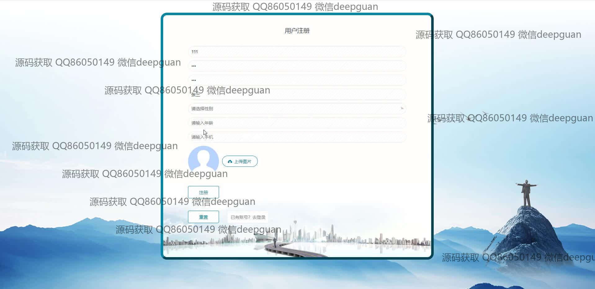
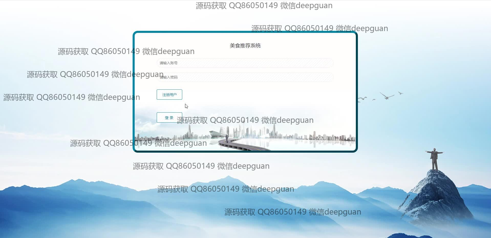

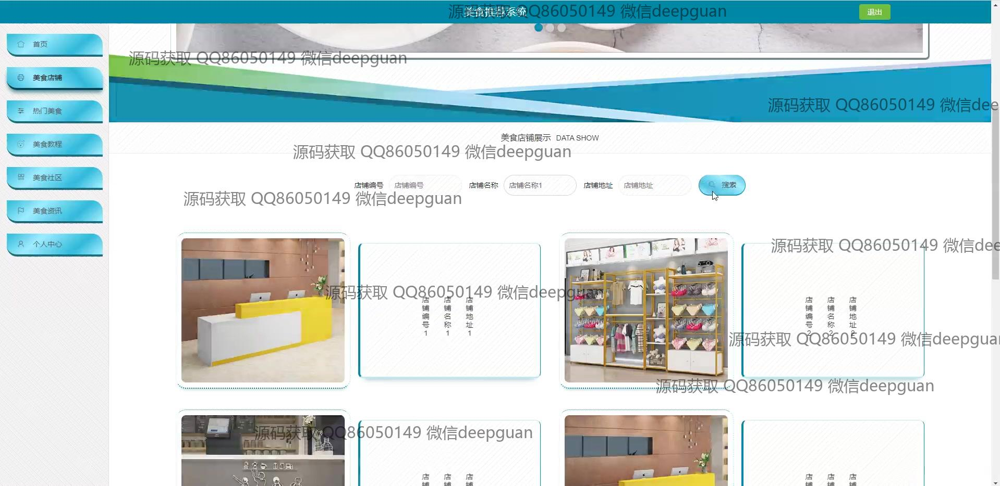
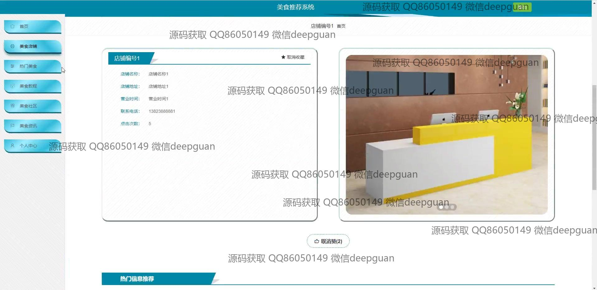
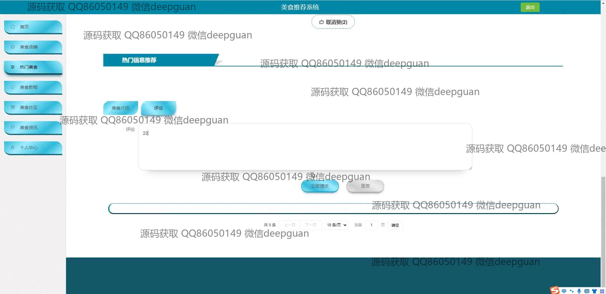
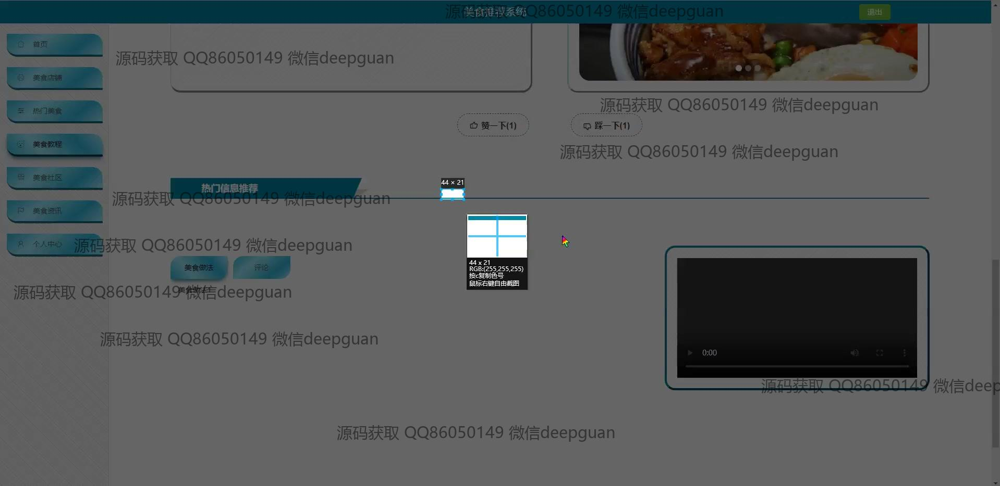
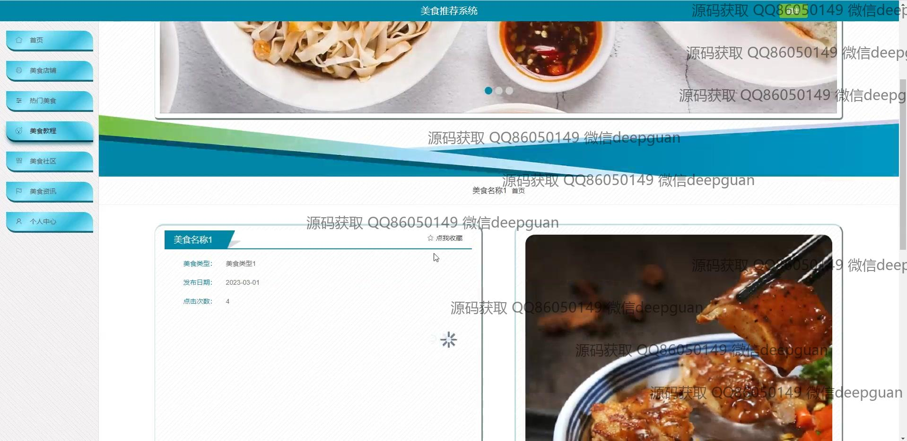
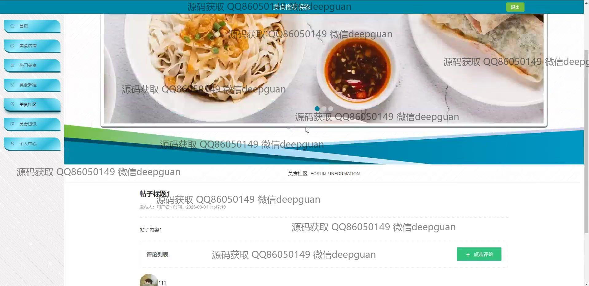
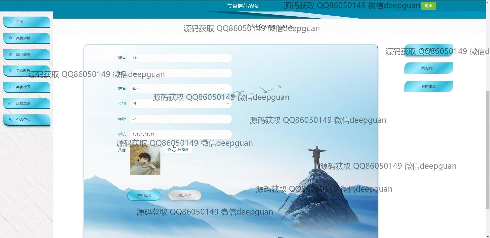
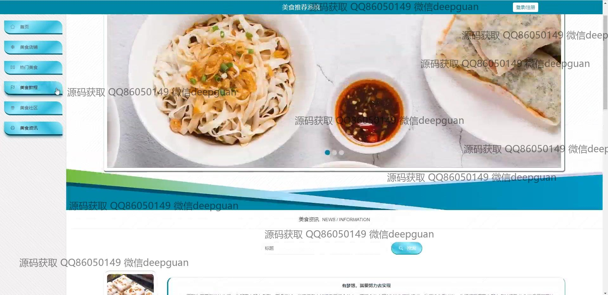
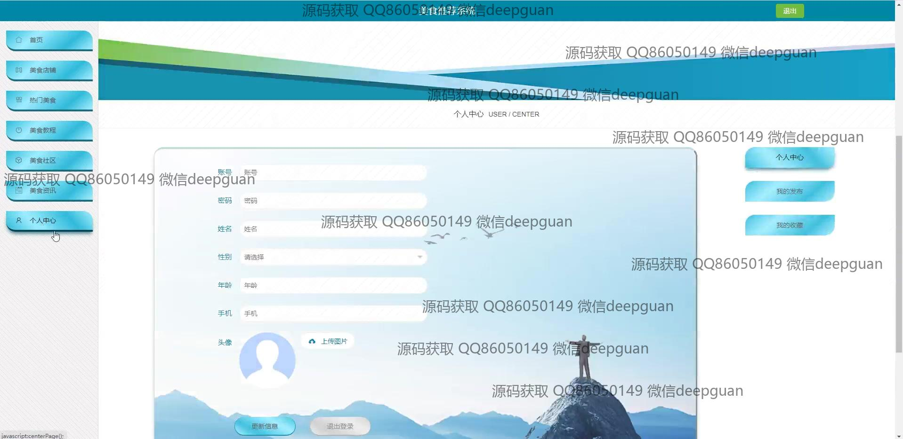

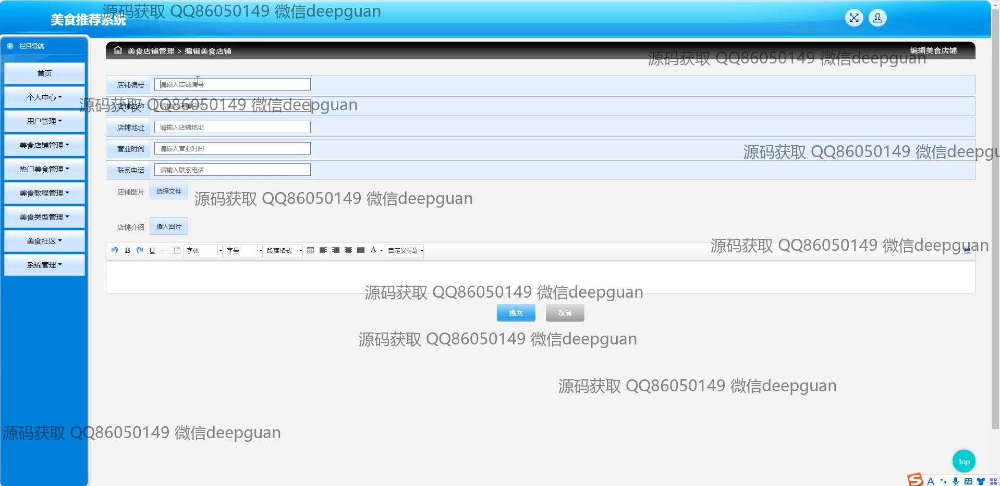
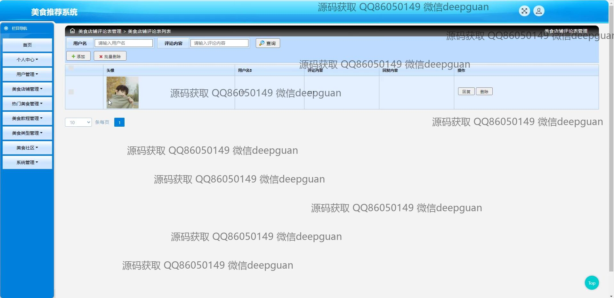
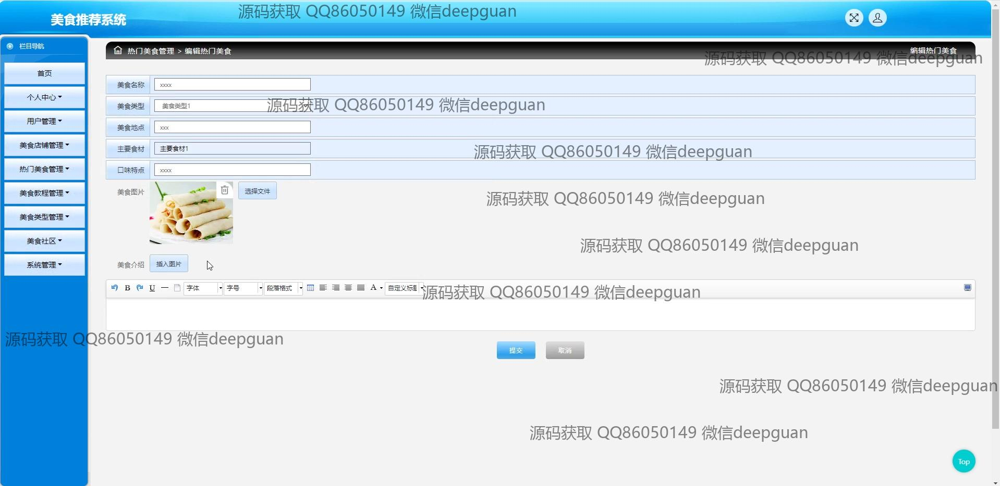
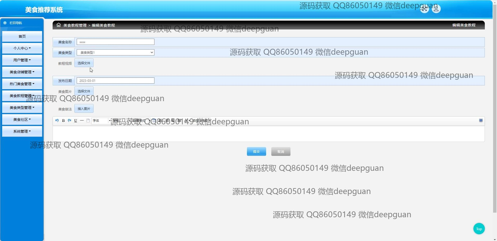
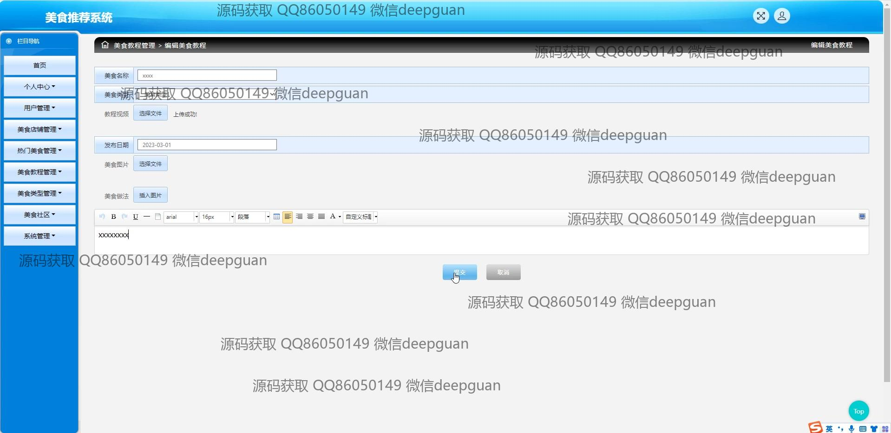

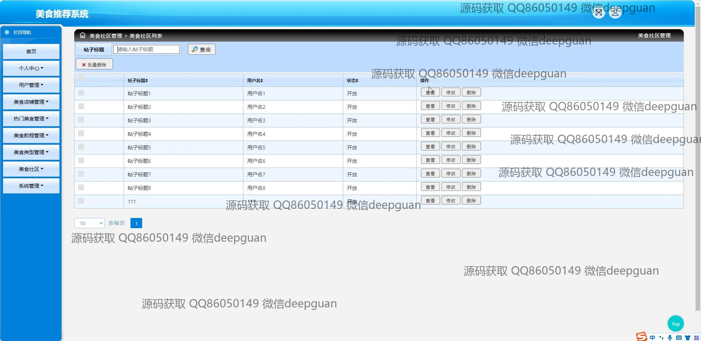
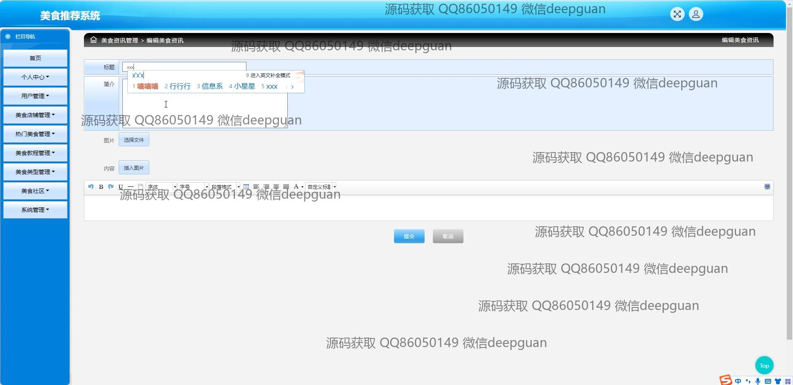
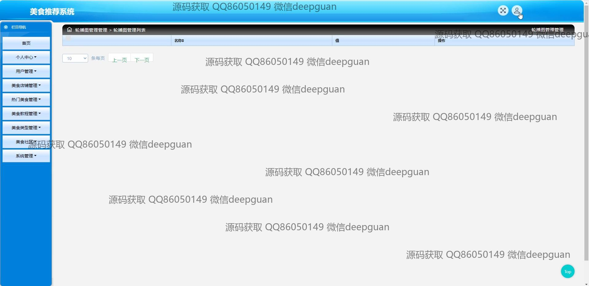

本代码来源于网络,仅供学习参考使用!

